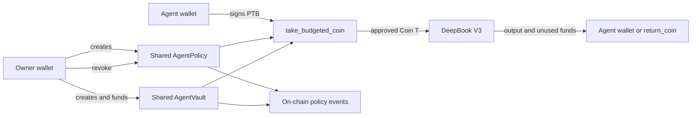

# AgentWallet on Sui

AgentWallet is policy-enforced wallet infrastructure for autonomous AI agents.
On Sui, an owner creates a separate agent wallet, places strategy funds in a
shared `AgentVault`, and publishes an `AgentPolicy` that controls how the agent
may use those funds. The agent signs its own DeepBook actions without asking the
owner to approve every transaction, while the Move policy enforces the budget,
allowed pool, expiry, and revocation state on-chain.

This implementation targets the **Sui Overflow 2026 Agentic Web track**,
**Autonomous Agent Wallet** sub-track.

## Links

- Live application: [agentwallet-web.vercel.app/app](https://agentwallet-web.vercel.app/app)
- Public repository: [github.com/kim-mac/AgentWallet](https://github.com/kim-mac/AgentWallet)
- Sui Move source: [`sui/agent_wallet/sources/policy.move`](sui/agent_wallet/sources/policy.move)
- SDK source: [`packages/agentwallet-sdk`](packages/agentwallet-sdk)
- Technical Move package reference: [`sui/agent_wallet/README.md`](sui/agent_wallet/README.md)

## Testnet deployment

| Item | Value |
| --- | --- |
| Network | Sui testnet |
| AgentWallet package | `0x768743700b22d533d228719672e17009a48a4dac473ae7f1d1d2733f6c1defa9` |
| Module | `policy` |
| Published version | `1` |
| Sui CLI used | `1.73.0` |
| DeepBook V3 package | `0xbc331f09e5c737d45f074ad2d17c3038421b3b9018699e370d88d94938c53d28` |

The published package metadata is committed in
[`sui/agent_wallet/Published.toml`](sui/agent_wallet/Published.toml).

## What the Sui implementation proves

| Overflow requirement | AgentWallet proof |
| --- | --- |
| Real DeepBook orders | The agent submits real DeepBook V3 limit orders and exact-input market swaps on Sui testnet. |
| Self-enforced budget ceiling | `take_budgeted_coin<T>` aborts in Move when an action exceeds `remaining_budget`. |
| Protocol scope | The policy stores allowed DeepBook pool object IDs and rejects any other pool. |
| Time-limited authority | Every agent spend compares the Sui Clock timestamp with `expires_at_ms`. |
| On-chain activity log | Policy creation, vault creation/funding/return, budget usage, and revocation emit Move events. |
| Owner revocation | The owner can call `revoke`; later agent actions abort before funds leave the vault. |
| Agent autonomy | A separate agent key signs DeepBook actions after the owner creates the mandate. The owner does not sign each trade. |

## Architecture



### Trust boundary

- The owner controls policy creation, policy scope, vault funding, and
  revocation.
- The agent has a distinct Ed25519 Sui key and signs strategy transactions.
- Strategy funds remain in the shared vault until the Move policy releases an
  approved amount.
- The web application and SDK can prepare transactions, but they cannot bypass
  Move assertions.
- DeepBook settlement evidence is derived from transaction events and balance
  changes, not a hardcoded success message.

## Judge-ready dashboard flow

Open the [live app](https://agentwallet-web.vercel.app/app), select **Sui** in
the sidebar, and follow the numbered steps.

1. **Set a wallet password**
   - Use at least eight characters.
   - The browser derives an AES-GCM key with PBKDF2 and encrypts the local owner
     and agent key bundle.
2. **Create wallets**
   - AgentWallet generates separate owner and agent Ed25519 wallets.
   - The encrypted bundle and Sui object configuration are stored in browser
     local storage for this testnet experience.
3. **Fund testnet wallets**
   - Fund both addresses with testnet SUI for gas.
   - The owner also needs enough SUI to fund the selected policy budget.
4. **Unlock wallets**
   - Enter the password to decrypt keys locally for the current browser
     session.
5. **Create the mandate**
   - Example: `max 0.5 SUI, DeepBook only, expires 24h`
   - Select a verified DeepBook market.
6. **Launch the agent**
   - The owner creates the shared policy and vault, funds the full budget, and
     the agent creates its DeepBook balance manager.
   - Launching does not place the first trade. Trades come from the agent
     console.
7. **Run agent actions**
   - Submit market or limit actions from the agent console.
   - Review used/remaining budget, acquired-asset balances, order evidence,
     activity events, and Explorer links.
8. **Prove enforcement**
   - Run an action larger than the remaining budget and observe the Move abort.
   - Click **Revoke agent access**, then retry an action and observe the
     revocation rejection.

## Agent console commands

The current dashboard uses a deterministic rule-based command parser. These
commands are converted into Sui PTBs and signed by the agent wallet:

```text
market buy 0.5 SUI of DEEP
limit buy 0.1 SUI of DEEP
market sell 1 SUI for USDC
show budget
show orders
test over budget
```

The agent automatically uses the verified pool configuration, checks current
DeepBook liquidity for market orders, selects the matching base/quote Move
types, constructs the PTB, signs it, submits it, and verifies settlement.

The current implementation is a rule-based executor. It does not yet run a
continuous price-monitoring loop or an LLM strategy scheduler. That runtime can
use the same SDK and policy objects without changing the on-chain controls.

## Supported DeepBook testnet markets

### DEEP / SUI

| Item | Value |
| --- | --- |
| Pool key | `DEEP_SUI` |
| Pool object | `0x48c95963e9eac37a316b7ae04a0deb761bcdcc2b67912374d6036e7f0e9bae9f` |
| Base type | `0x36dbef866a1d62bf7328989a10fb2f07d769f4ee587c0de4a0a256e57e0a58a8::deep::DEEP` |
| Quote type | `0x2::sui::SUI` |
| Supported execution | Limit and market |

### SUI / DBUSDC

| Item | Value |
| --- | --- |
| Pool key | `SUI_DBUSDC` |
| Pool object | `0x1c19362ca52b8ffd7a33cee805a67d40f31e6ba303753fd3a4cfdfacea7163a5` |
| Base type | `0x2::sui::SUI` |
| Quote type | `0xf7152c05930480cd740d7311b5b8b45c6f488e3a53a11c3f74a6fac36a52e0d7::DBUSDC::DBUSDC` |
| Supported execution | Limit and market |

Verified market IDs and defaults live in
[`apps/web/lib/sui-dashboard.ts`](apps/web/lib/sui-dashboard.ts).

## Move objects

### `AgentPolicy`

A shared owner-controlled object containing:

- owner address
- authorized agent address
- maximum and remaining budget
- allowed DeepBook pool object IDs
- expiry timestamp
- revocation state
- successful action count

### `AgentVault<T>`

A shared typed vault containing:

- the associated policy object ID
- the strategy asset balance

The agent cannot withdraw arbitrary funds from the vault. It receives a
`Coin<T>` only through `take_budgeted_coin<T>`, after every policy assertion
passes.

## Policy-enforced PTBs

### Market execution

1. `policy::take_budgeted_coin<T>` releases the approved exact-input amount.
2. DeepBook executes `swap_exact_quote_for_base` or
   `swap_exact_base_for_quote` against the allowlisted pool.
3. Output and unused coins are transferred to the agent wallet.
4. The dashboard verifies the DeepBook event or agent balance change.

### Limit execution

1. `policy::take_budgeted_coin<T>` releases the approved amount.
2. The coin is deposited into the agent-owned DeepBook balance manager.
3. The agent generates a balance-manager proof.
4. DeepBook `place_limit_order` submits the order against the allowlisted pool.
5. Order events are filtered to the selected agent balance manager.

The budget is consumed when the policy releases funds for the action. Unused
funds can be returned through `policy::return_coin<T>` in a composed PTB. The
current market path transfers DeepBook output and any input refund to the agent
wallet; the current limit path deposits the released amount into the agent's
DeepBook balance manager.

## On-chain enforcement

`take_budgeted_coin<T>` verifies all of the following before splitting funds
from the vault:

1. The vault belongs to the selected policy.
2. The transaction sender is the configured agent.
3. The owner has not revoked the policy.
4. The policy has not expired according to the Sui Clock.
5. The requested amount is greater than zero.
6. The amount does not exceed the remaining budget.
7. The DeepBook pool is on the policy allowlist.

Move abort codes:

| Code | Meaning |
| --- | --- |
| `0` | Sender is not the owner |
| `1` | Sender is not the configured agent |
| `2` | Policy revoked |
| `3` | Policy expired |
| `4` | Pool not allowed |
| `5` | Invalid budget or amount |
| `6` | Amount exceeds remaining budget |
| `7` | Vault and policy do not match |

The web application maps these aborts and common Sui/DeepBook failures into
human-readable owner and agent messages.

## On-chain activity log

The Move module emits:

| Event | Purpose |
| --- | --- |
| `PolicyCreated` | Records owner, agent, budget, and expiry |
| `AgentVaultCreated` | Links a typed vault to its policy |
| `AgentVaultFunded` | Records deposits into the vault |
| `AgentBudgetUsed` | Records agent, pool, action, amount, remaining budget, count, and timestamp |
| `AgentVaultReturned` | Records unused funds returned to the vault |
| `PolicyRevoked` | Records owner revocation |

The dashboard queries Sui testnet events, scopes them to the active policy and
vault, and renders transaction links. DeepBook order evidence is separately
filtered by the agent's balance manager so counterparty maker orders are not
shown as agent actions.

## Example testnet evidence

- Filled DEEP/SUI market swap:
  [2zygeT97rXL1Az2xBBJ4MyUNQnkAfas7bMeHUa7wwaXW](https://suiexplorer.com/txblock/2zygeT97rXL1Az2xBBJ4MyUNQnkAfas7bMeHUa7wwaXW?network=testnet)
- Owner revocation:
  [FkywRDLgiarkQApkzBXEak3fzRqpSwT2k7nsaLmdWdut](https://suiexplorer.com/txblock/FkywRDLgiarkQApkzBXEak3fzRqpSwT2k7nsaLmdWdut?network=testnet)

Object IDs are created for each new owner/agent mandate, so policy, vault, and
balance-manager IDs shown in the dashboard will differ between runs.

## Run locally

Requirements:

- Node.js 20 or newer
- npm
- A modern browser with Web Crypto support
- Testnet SUI for the generated owner and agent addresses

Install and start the app:

```bash
npm install
npm run dev
```

Open `http://localhost:3000/app`, select **Sui**, and follow the guided flow.
No private-key environment variables are required for the dashboard path.

## Build and test

Run the web and SDK checks:

```bash
npm test -w @agentspend/web
npm test -w @agentwallet/sdk
npm run typecheck -w @agentspend/web
npm run build -w @agentspend/web
```

Run Move tests with an installed Sui CLI:

```bash
sui move build --path sui/agent_wallet
sui move test --path sui/agent_wallet
```

The repository also includes a Windows x86_64 Sui CLI workflow documented in
[`sui/agent_wallet/README.md`](sui/agent_wallet/README.md). Move tests cover:

- agent-only spending
- pool allowlist enforcement
- budget ceiling enforcement
- expiry enforcement
- owner revocation enforcement
- budget and action accounting

## CLI and SDK path

The dashboard is the recommended judge path. The SDK also includes CLI runners
for direct integration and debugging:

```bash
npm run sui:owner -w @agentwallet/sdk -- create-policy
npm run sui:owner -w @agentwallet/sdk -- create-vault
npm run sui:owner -w @agentwallet/sdk -- fund-vault
npm run sui:deepbook -w @agentwallet/sdk -- create-balance-manager
npm run sui:deepbook-demo -w @agentwallet/sdk
npm run sui:owner -w @agentwallet/sdk -- revoke-policy
```

The dashboard generates copyable environment-variable snippets after object
IDs are known. See the [technical package README](sui/agent_wallet/README.md)
for the full variable reference.

## Repository map

| Path | Responsibility |
| --- | --- |
| `sui/agent_wallet/sources/policy.move` | Sui policy and vault objects, enforcement, events, and Move tests |
| `packages/agentwallet-sdk/src/index.ts` | PTB plan builders and Sui transaction conversion |
| `packages/agentwallet-sdk/src/sui-*.ts` | Owner, agent, DeepBook, and event CLI helpers |
| `apps/web/lib/sui-dashboard-actions.ts` | Dashboard action construction and submission |
| `apps/web/lib/sui-agent-command.ts` | Rule-based agent command parser |
| `apps/web/lib/sui-dashboard.ts` | Market catalog, event parsing, budget state, and order evidence |
| `apps/web/app/api/sui/*` | Sui activity, balance, quote, and DeepBook-order APIs |
| `apps/web/app/dashboard.tsx` | Guided Sui owner and agent experience |

## Security properties

- Policy enforcement happens in Move, outside agent prompts and application
  code.
- Owner and agent identities are separate.
- Vault funds cannot be released by an unauthorized signer.
- Budget, pool scope, expiry, and revocation are checked atomically before
  funds enter DeepBook.
- The policy and vault object IDs are bound together.
- Settlement is not marked filled without DeepBook events or an agent balance
  change.
- Browser wallet bundles are encrypted at rest with AES-GCM using a
  password-derived key.

## Current limitations

- Testnet only.
- The Sui browser wallet bundle is stored locally, not synchronized between
  devices.
- The agent console is deterministic and rule-based; continuous strategy
  scheduling and external model integrations are future runtime layers.
- Only the verified DEEP/SUI and SUI/DBUSDC testnet markets are preconfigured.
- Market execution depends on live DeepBook testnet liquidity.
- Creating a new mandate creates new policy and vault objects rather than
  reactivating a revoked or exhausted policy.

These limitations do not weaken on-chain enforcement: any runtime using the
agent key must still pass the same Move policy before vault funds can be used.
